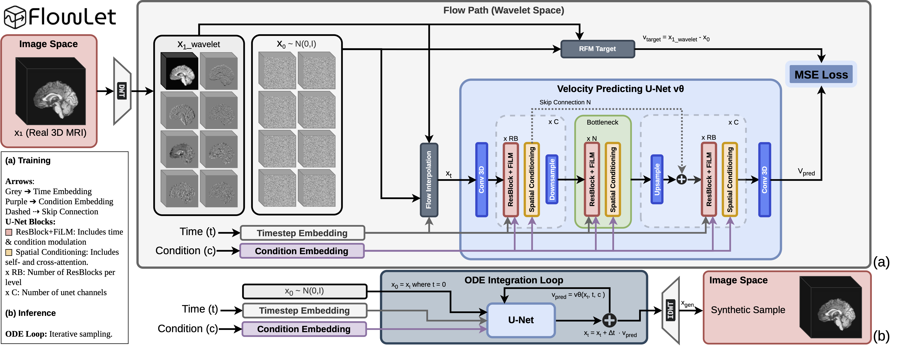

# FlowLet: Conditional 3D Brain MRI Synthesis using Wavelet Flow Matching

**Development repository** for *"FlowLet: Conditional 3D Brain MRI Synthesis using Wavelet Flow
Matching"* (**Medical Image Analysis**, Elsevier). It holds the full codebase: the core synthesis
library **plus** the downstream **brain-age prediction (BAP)**
and **region-based (ROI)** evaluation pipelines used in the paper.

> The original release lives at **[sisinflab/FlowLet](https://github.com/sisinflab/FlowLet)**.
> This repository is for ongoing development and the additional evaluation code.

🌐 **Project page:** https://danesed.github.io/flowlet-page/ &nbsp;·&nbsp; 📄 **Paper:** [Medical Image Analysis](https://www.sciencedirect.com/journal/medical-image-analysis) · [arXiv](https://arxiv.org/pdf/2601.05212)

FlowLet is a conditional generative framework that synthesizes age-conditioned 3D brain MRI
volumes. It performs **Flow Matching** directly in an invertible **3D Haar wavelet domain**,
which gives multi-scale generation **without learned latent compression** and **deterministic
ODE sampling**. Age is injected through two complementary mechanisms:
**FiLM** (feature-wise modulation) and **spatial cross-attention**, for explicit control over
age-related morphology.

<p align="center">
  
</p>

## Key features

* **Wavelet flow matching**: generative modeling in the 3D Haar wavelet domain, with four
  selectable flow formulations (Rectified, CFM, VP-diffusion, Trigonometric).
* **Dual age conditioning**: FiLM in the residual blocks (global) plus cross-attention in the
  transformer blocks (spatially adaptive).
* **Fast deterministic sampling**: Euler ODE integration; high-quality samples in few steps, best results at ~100 steps.
* **Modular 3D U-Net**: configurable channels/depth/attention, optional `xformers`
  memory-efficient attention and gradient checkpointing (trains within 24 GB VRAM at BS=1).


## Repository structure

```
flowlet/                  Core library
├── wavelets/             Invertible 3D Haar DWT / IDWT
├── models/               WaveletFlowMatching + conditional 3D U-Net
├── modules/              U-Net building blocks (ResBlock+FiLM, attention, embeddings)
├── data/                 NIfTI datasets (folder & CSV) + dataloaders/transforms
├── training/             Training loop (checkpointing, early stopping, W&B)
├── generation/           Conditioned sampling and NIfTI export
├── evaluation/           Training-time reconstruction metrics and visualizations
└── utils/                Seeding, logging, checkpoint slimming
scripts/                  Command-line entry points (train / generate / generate_linear)
configs/                  Example config.json and condition_ranges.json
Dataset_preparation/      Catalog-building helpers + an example catalog (CSV format)
assets/                   Architecture figure
training_FlowLet.sh       Example training launcher
generate_linear.sh        Example generation launcher

_externals/                External evaluation techniques
├── BAP/                  Downstream brain-age prediction (synthetic-data processing + DenseNet trainer)
└── ROI_metrics/          Region-based evaluation (FastSurfer parcellation + Dice/ROI metrics)
```

## Installation

The framework was developed with Python 3.11+ and CUDA 12.x.

```bash
conda create -n flowlet_env python=3.11
conda activate flowlet_env
pip install -r requirements.txt
```

`xformers` (listed in `requirements.txt`) is optional but recommended for memory-efficient
attention. If it is unavailable on your platform, the model falls back to PyTorch attention
automatically; pass `--no-use_xformers` to disable it explicitly.

## Data

### Access

Due to patient-privacy regulations and data-use agreements, the MRI scans cannot be
redistributed here. The datasets used in the paper are openly available to researchers upon request:

* **OpenBHB** — https://baobablab.github.io/bhb/dataset
* **ADNI** — https://adni.loni.usc.edu/
* **OASIS-3** — https://sites.wustl.edu/oasisbrains/


### Preprocessing

All volumes are expected to be preprocessed with a standardized pipeline before training or
generation. Our pipeline uses ANTs and FSL:

1. **Bias-field correction** — N4ITK (ANTs).
2. **Spatial normalization** — affine registration to MNI152 with FSL FLIRT.
3. **Skull stripping** — FSL BET.
4. **Resampling** — to an isotropic grid of `91 × 109 × 91`.
5. **Intensity normalization** — z-score (zero mean, unit variance).

See the paper for full details.

### Dataset preparation

The trainer reads data in one of two ways. The metadata-CSV path is recommended.

**Method 1 — metadata CSV (recommended).** Provide a CSV with one row per scan, an absolute
`FilePath` column, and one column per condition (e.g. `Age`, `Condition`). You can build it
from a folder of NIfTI files whose names embed the age (the regex looks for
`[_-]AGE[_-]<value>`):

```bash
PYTHONPATH=. python3 Dataset_preparation/create_metadata_csv.py \
    --input_dirs /path/to/your/nifti/data \
    --output_csv ./Dataset_preparation/metadata/main_dataset_catalog.csv \
    --condition_label CN
```

`Dataset_preparation/rename_niftifiles.py` is a helper for the OASIS-3 cohort that filters
cognitively-normal subjects from a metadata CSV and renames files to embed the age tag.

**Method 2 — filename parsing.** Point the trainer at a folder of `.nii.gz` files whose names
contain the conditions (e.g. `subject001_AGE_65.3.nii.gz`) via `--data_folder`.

## Training

The entry point is [`scripts/train.py`](scripts/train.py). A ready-to-edit launcher is
provided in [`training_FlowLet.sh`](training_FlowLet.sh).

```bash
PYTHONPATH=. python3 -u scripts/train.py \
    --metadata_csv ./Dataset_preparation/metadata/main_dataset_catalog.csv \
    --csv_filter_col Condition --csv_filter_value CN \
    --condition_vars Age \
    --flow_type rectified \
    --epochs 200 --batch_size 4 --lr 3e-6 \
    --model_input_size 112 112 112 --save_size 91 109 91 \
    --unet_model_channels 128 --unet_channel_mult "1,2,4,8" --unet_attention_res "4,8" \
    --use_xformers --use_checkpointing \
    --run_name FlowLet_RFM --wandb
```

Checkpoints, the resolved `config.json`, and `condition_ranges.json` are written to
`<checkpoint_dir>/<run_name>/`. The two JSON files are then consumed by the generation
scripts.

### Key arguments

| Argument | Description |
| --- | --- |
| `--metadata_csv` / `--data_folder` | Dataset source (CSV catalog, recommended, or NIfTI folder). |
| `--condition_vars` | Conditioning variables (CSV columns or filename-parsed), e.g. `Age`. |
| `--flow_type` | Flow formulation: `rectified`, `cfm`, `vp_diffusion`, `trigonometric`. |
| `--model_input_size` | Spatial size volumes are padded to before the DWT (must suit the U-Net depth). |
| `--save_size` | Final crop size applied to generated volumes after the IDWT. |
| `--unet_*` | U-Net architecture (channels, `channel_mult`, attention resolutions, heads, …). |
| `--lll_loss_weight` / `--detail_loss_weight` | Weights for the approximation (LLL) and detail subband losses. |
| `--wandb` | Enable Weights & Biases logging (`--no-wandb` to disable). |

## Generating samples

Both scripts rebuild the model from the run's `config.json` and normalize ages using the run's
`condition_ranges.json`.

**Linearly interpolated ages** — sweep age smoothly across a range; ideal for building large,
age-balanced sets. See [`scripts/generate_linear.py`](scripts/generate_linear.py) and the
[`generate_linear.sh`](generate_linear.sh) launcher.

```bash
PYTHONPATH=. python3 -u scripts/generate_linear.py \
    --checkpoint_path checkpoints_flowlet/<run_name>/fmw_best.pth \
    --config_path     checkpoints_flowlet/<run_name>/config.json \
    --condition_ranges_path checkpoints_flowlet/<run_name>/condition_ranges.json \
    --output_dir ./generated_samples/<run_name>/linear_age \
    --min_age 5.9 --max_age 95.5 \
    --num_total_samples 3000 --num_flow_steps 10 \
    --save_size 91 109 91
```

`generate_linear.py` also contains a `generation_modes` dictionary that re-runs the sweep with
individual conditioning mechanisms disabled (`baseline`, `film_only`, `crossattn_only`,
`unconditional`), writing each mode to its own subdirectory.

**Specific conditions** — generate a fixed number of samples for discrete condition values via
[`scripts/generate.py`](scripts/generate.py).

```bash
PYTHONPATH=. python3 -u scripts/generate.py \
    --checkpoint_path checkpoints_flowlet/<run_name>/fmw_best.pth \
    --condition_ranges_path checkpoints_flowlet/<run_name>/condition_ranges.json \
    --output_dir ./generated_samples/<run_name>/specific \
    --generation_conditions "Age=45" "Age=70.5" \
    --num_synthetic 50 --save_size 91 109 91
```

## Slimming checkpoints for sharing / inference

Training checkpoints (`fmw_best.pth`, `fmw_last.pth`) bundle the optimizer, scheduler and
gradient-scaler states so training can resume, which makes them large. For release or
inference you only need the model weights. [`flowlet/utils/checkpoint_utils.py`](flowlet/utils/checkpoint_utils.py)
strips the extra state (and removes any `_orig_mod.` / `module.` prefixes), optionally embedding
the key architecture fields from `config.json` inside the slimmed file.

```bash
PYTHONPATH=. python3 -m flowlet.utils.checkpoint_utils \
    --input_path  checkpoints_flowlet/<run_name>/fmw_best.pth \
    --output_path checkpoints_flowlet/<run_name>/fmw_best_slim.pth \
    --config_path checkpoints_flowlet/<run_name>/config.json     # optional: embeds the config
```

The slimmed file stores the weights under `model_state_dict`, which the generation scripts load
directly — just point `--checkpoint_path` at it (still pass `--config_path` / `--condition_ranges_path`
as usual). `--log_dir` (default `.`) sets where the run log is written.

## Flow-matching formulations

FlowLet implements four flow formulations under a shared architecture and training setup. The
paper names map to the `--flow_type` CLI values as follows:

| Paper | `--flow_type` | Path between noise and data |
| --- | --- | --- |
| RFM (Rectified Flow Matching) | `rectified` | Straight linear interpolation, constant velocity. |
| CFM (Conditional Flow Matching) | `cfm` | Linear path with a time-dependent target velocity. |
| VP (Variance-Preserving diffusion) | `vp_diffusion` | Curved DDPM-style path from a variance schedule. |
| Trigonometric | `trigonometric` | Circular (half-circle) interpolation, constant norm. |


## Configuration files

`configs/config.json` is an example training configuration, and `configs/condition_ranges.json`
shows the age range format used to normalize the conditioning variable. At training time the
effective `config.json` and `condition_ranges.json` are generated automatically inside the run
directory; those generated copies are what the generation scripts consume.


## Downstream evaluation: BAP & ROI

Beyond core synthesis, the `_externals/` folder holds the two evaluation pipelines from the paper,
kept as separate, self-contained components (each with its own README and `requirements.txt`).

- **`_externals/BAP/` — brain-age prediction.** [`_externals/BAP/processing/`](_externals/BAP/processing/README.md)
  turns generated NIfTI volumes into standardized NumPy datasets with metadata, and
  [`_externals/BAP/BAP_trainer/`](_externals/BAP/BAP_trainer/README.md) trains and evaluates the
  DenseNet brain-age predictor on real and synthetic data.
- **`_externals/ROI_metrics/` — region-based anatomical fidelity.** [`_externals/ROI_metrics/`](_externals/ROI_metrics/README.md)
  runs FastSurfer segmentation/parcellation and computes the proposed region-wise metrics
  (Dice, intensity MAE, KL divergence) between synthetic and real volumes across 95 ROIs.

Run each component from its own folder following its README.

## Citation

If you use FlowLet, please cite the paper:

```bibtex
ARXIV
@article{danese2026flowlet,
  title={FlowLet: Conditional 3D Brain MRI Synthesis using Wavelet Flow Matching},
  author={Danese, Danilo and Lombardi, Angela and Attimonelli, Matteo and Fasano, Giuseppe and Di Noia, Tommaso},
  journal={arXiv preprint arXiv:2601.05212},
  year={2026}
}

OFFICIAL - DOI TO_BE_ASSIGNED
@article{danese2026flowlet,
  title   = {FlowLet: Conditional 3D Brain MRI Synthesis using Wavelet Flow Matching},
  author  = {Danese, Danilo and Lombardi, Angela and Attimonelli, Matteo and Fasano, Giuseppe and Di Noia, Tommaso},
  journal = {Medical Image Analysis},
  year    = {2026},
  publisher = {Elsevier},
  DOI    = {TO_BE_ASSIGNED}
}
```

## License

Released under the [MIT License](LICENSE).
